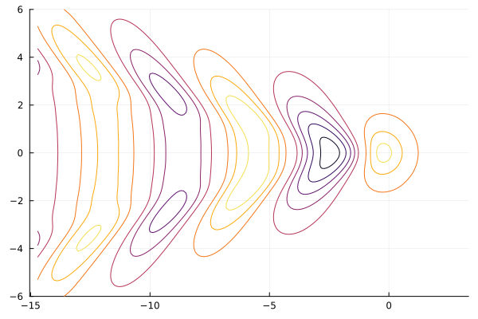

# NeumannKelvin

[](https://github.com/weymouth/NeumannKelvin.jl/actions/workflows/CI.yml?query=branch%3Amain)



Calculation of the linear free surface potential using source and Neumann-Kelvin Greens Functions.

## Capabilities

This package defines three `PanelSystem` structs:
1. `BodyPanelSystem` for bodies in unbounded potential flow, defined using a set of source panels covering the solid body. The Neumann (flow tangency) condition is applied to each panel. 
2. `FSPanelSystem` for free surface potential flows, defined using a set of source panels covering both the body and free surface interface. The linear FSBC (free-surface boundary condition) is applied to the free surface panels.
3. `NKPanelSystem` for free surface potential flows, defined using a set of Kelvin panels on the body which automatically satisfy the linear FSBC on `z=0`. The Neumann condition is applied on each panel.

The package also defines:
 - `PanelTree` struct to accelerate the evaluation of the potential over a sets of panels using a Barnes-Hut style monopole approximation for panels far from the query point.
 - `directsolve!`,`gmresolve!` functions to solve for the system source strength.
 - Functions to measure the induced potential `Φ` and it's various "downstream" properties `∇Φ,u,cₚ,steadyforce,addedmass,ζ`, where all derivatives are computed using `ForwardDiff.jl`.
 
## Basic usage

The panels themselves can either be defined by reading in a triangle Mesh object or by measuring a parametric surface. For example a spheroid under the free surface may be defined as:
```julia
using NeumannKelvin
h = 0.1 # spacing
freesurf = measure.((u,v)->SA[u,v,0],1:-h:-2,(1:-h:-1)',h,h)
S(θ₁,θ₂) = SA[0.5cos(θ₁),-0.1sin(θ₂)*sin(θ₁),0.1cos(θ₂)*sin(θ₁)-0.15]
body = panelize(S,0,π,0,2π,hᵤ=h)
```
The `measure` function measures a parametric surface into a panel given a center and extent in `u,v`. Here, we broadcast `measure` over a simple planar surface to define the free surface mesh `freesurf`. The `panelize` function generalizes this proceedure, adaptively sampling a parametric surface over a given `u,v` range to achieve a desired spacing and deviation tolerance between the panels and original surface. The `panelize` function returns a `Table` from TypedTables.jl since the method won't geneally form a structured grid. See the documentation for `measure`, `panelize` for details.

Next the panel system can be defined and solved. For an unbounded potential flow solution with a small number of panels like this one, we can use
```julia
julia> sys = BodyPanelSystem(body) |> directsolve!
┌ Warning: This routine ignores free surface panels and is memory intensive. See help?>directsolve!.
└ @ NeumannKelvin ~/Workspace/NeumannKelvin.jl/src/solvers.jl:72
  0.001468 seconds (53 allocations: 259.781 KiB)
BodyPanelSystem
  body: Table with 9 columns and 96 rows
     area & volume: 0.5019560344511921, 0.02079102608493166
     panel type: NeumannKelvin.QuadKernel
  background flow U: [-1, 0, 0]
  mirrors: ([1, 1, 1],)
  strength extrema: (-0.07478205822184282, 0.07478205822184263)
```
You can see that some basic properties of the panelized body, panel type, flow parameters, and solution are shown. You can also see the solution method is very fast, 1.5ms on an old laptop for this small 96 panel system. 

For larger systems, it's very helpful to accelerate the solution by wrapping the panels in a `PanelTree` and using the matrix-free iterative solver:
```julia
julia> bigbody = panelize(S,0,π,0,2π,hᵤ=1/200,N_max=Inf); #20k panels

julia> sys = BodyPanelSystem(bigbody,wrap=PanelTree) |> gmressolve!
SimpleStats
 niter: 4
 solved: true
 inconsistent: false
 indefinite: false
 npcCount: 0
 residuals: []
 Aresiduals: []
 κ₂(A): []
 timer: 5.21s
 status: solution good enough given atol and rtol

BodyPanelSystem
  body: PanelTree(20096 panels, 16 levels, θ²: 9)
     area & volume: 0.5019251097019334, 0.020944737007987515
     panel type: NeumannKelvin.QuadKernel
  background flow U: [-1, 0, 0]
  mirrors: ([1, 1, 1],)
  strength extrema: (-0.0870901881812633, 0.08709074525159466)
```
This body defined with 20k panels is fairly quick to solve using this approach. See the documentation for `PanelTree` and `gmressolve!` for details. Since this body is symmetric in y, we could further increase the speed by using a half of the body and applying the method of images on the symmetry axis. 
```julia
julia> halfbody = panelize(S,0,π,0,π,hᵤ=1/200,N_max=Inf); # half the θ₂ range

julia> BodyPanelSystem(halfbody,wrap=PanelTree,sym_axes=2) |> gmressolve!
SimpleStats
 niter: 4
 solved: true
 inconsistent: false
 indefinite: false
 npcCount: 0
 residuals: []
 Aresiduals: []
 κ₂(A): []
 timer: 3.66s
 status: solution good enough given atol and rtol

BodyPanelSystem
  body: PanelTree(10048 panels, 15 levels, θ²: 9)
     area & volume: 0.25096255485096675, 0.01047237643741015
     panel type: NeumannKelvin.QuadKernel
  background flow U: [-1, 0, 0]
  mirrors: ([1, -1, 1], [1, 1, 1])
  strength extrema: (-0.08747539911219701, 0.08749685245478749)
```
Where we see the half the panels and a reduced solve time, but also the new `mirror=[1,-1,1]` enforcing symmetry and therefore the same solution extrema. 

With the system solved, we can now measure any properties of interest. For example, the extreme values of the pressure coefficient and the added mass. 
```julia
julia> extrema(cₚ(sys))
(-0.12323837497458068, 0.977864810013905)

julia> addedmass(sys)
3-element SVector{3, Float64} with indices SOneTo(3):
 0.05907144178034771
 7.054090093897268e-5
 3.247604894181291e-5
```
The max cₚ=1 because of the stagnation point, but the added mass is small because the flow direction was aligned with the long axis of the spheriod. We can check the other added mass coefficient by rotating the body or (easier) the background flow:
```julia
julia> BodyPanelSystem(body,U=SA[0,1,0]) |> directsolve! |> addedmass
┌ Warning: This routine ignores free surface panels and is memory intensive. See help?>directsolve!.
└ @ NeumannKelvin ~/Workspace/NeumannKelvin.jl/src/solvers.jl:72
  0.005645 seconds (53 allocations: 163.781 KiB)
3-element SVector{3, Float64} with indices SOneTo(3):
  1.3036900728907295e-18
 -0.8487489964044264
 -7.463625667299426e-17
```

## Free surface panel systems

We've already defined the free surface panels, so we can easily define an `FSPanelSystem` covering both `body` and `freesurf`
```julia
ulia> FSsys = FSPanelSystem(body,freesurf, ℓ=0.3, θ²=16)
FSPanelSystem
  freesurf: PanelTree(651 panels, 11 levels, θ²: 16)
     size: (31, 21)
     panel type: NeumannKelvin.QuadKernel
  Froude length ℓ: 0.3
  body: PanelTree(96 panels, 8 levels, θ²: 16)
     area & volume: 0.5019560344511921, 0.02079102608493166
     panel type: NeumannKelvin.QuadKernel
  background flow U: [-1, 0, 0]
  mirrors: ([1, 1, 1],)
  strength extrema: (0.0, 0.0)
```
Note that we **must** define the Froude length ℓ≡U²/g to apply the FSBC. The panels are automatically wrapped in a `FSPanelSystem` for `FSPanelSystems` (because they tend to be much bigger) but you can disable this by using `wrap=identity` or adjust the Barnes-Hut cutoff using the `θ²` keyword argument. 

Currently, you **must** use the matrix-free `gmressolve!` to solve the `FSPanelSystem` because the FSBC influence matrix hasn't been implemented. The preconditioner is also fairly basic, and this might be worth optimizing in the future to reduce the number of GMRES iterations:
```julia
julia> gmressolve!(FSsys);
SimpleStats
 niter: 39
 solved: true
 inconsistent: false
 indefinite: false
 npcCount: 0
 residuals: []
 Aresiduals: []
 κ₂(A): []
 timer: 922.19ms
 status: solution good enough given atol and rtol
```
But the reduced solution speed is worth it, since we now can predict non-zero steady forces in potential flow
```julia
julia> steadyforce(FSsys)
3-element SVector{3, Float64} with indices SOneTo(3):
  0.0008095526294914972
 -1.1023608147049574e-5
  0.004378899512179288
```
The dynamic vertical force is much larger than the drag force because the body is very close to the free surface. 

We can also solve flows around surface peircing bodies. As a fun illustration of a Mesh-defined body, we can use a dolphin geometry!
```
using GeometryBasics,FileIO
function affine(mesh, A, b)  # rotate, scale, and shift the mesh
    position = [Point3f(A * p + b) for p in mesh.position]
    GeometryBasics.Mesh(position, mesh.faces)
end
dolphin = affine(load("examples/LowPolyDolphin.stl"), SA[0 -1 0;1 0 0;0 0 1]/65,SA[0.043,0,-0.08])
ℓ=0.4^2; h = 0.05; # define the Froude length and grid size
freesurf = measure.((u,v)->SA[u,v,0],2/3:-h:-4/3,(2/3:-h:-2/3)',h,h,T=Float32); # Float32 to match the Mesh
```
```juia
julia> sys = gmressolve!(FSPanelSystem(panelize(dolphin),freesurf;ℓ),itmax=150) # set itmax in case something went wrong
SimpleStats
 niter: 73
 solved: true
 inconsistent: false
 indefinite: false
 npcCount: 0
 residuals: []
 Aresiduals: []
 κ₂(A): []
 timer: 9.02s
 status: solution good enough given atol and rtol

FSPanelSystem
  freesurf: PanelTree(1107 panels, 12 levels, θ²: 9)
     size: (41, 27)
     panel type: NeumannKelvin.QuadKernel
  Froude length ℓ: 0.16000000000000003
  body: PanelTree(1456 panels, 12 levels, θ²: 9)
     area & volume: 0.4646912, 0.013457678
     panel type: NeumannKelvinGeometryBasicsExt.TriKernel
  background flow U: [-1, 0, 0]
  mirrors: ([1, 1, 1],)
  strength extrema: (-0.21055607f0, 0.18832724f0)
```
In this case, getting the steady force is underwhelming. Let's take a look!
```julia
using GLMakie # can also use Plots, or Web
viz(sys)
```
The `viz` function defines a few default vizualizations for the body and free surface.

## Neumann-Kelvin system

We can avoid the need for free surface panels by applying the Kelvin potential which satifies the linear FSBC by construction. This method is much faster, but more fragile. See the docs for `NKPanelSystem`, `kelvin`, and the cited references for details. 
```julia
julia> NKsys = NKPanelSystem(body;ℓ=0.3) |> directsolve!
┌ Warning: This routine ignores free surface panels and is memory intensive. See help?>directsolve!.
└ @ NeumannKelvin ~/Workspace/NeumannKelvin.jl/src/solvers.jl:72
  0.054494 seconds (53 allocations: 188.406 KiB)
NKPanelSystem
  Neumann-Kelvin args: (ℓ = 0.3, filter = true, contour = false)
  body: Table with 9 columns and 96 rows
     area & volume: 0.5019560344511921, 0.02079102608493166
     panel type: NeumannKelvin.QuadKernel
  background flow U: [-1, 0, 0]
  mirrors: ([1, 1, 1],)
  strength extrema: (-0.08957114973152222, 0.07384042832146091)

julia> steadyforce(NKsys)
3-element SVector{3, Float64} with indices SOneTo(3):
  0.019403909013166906
 -4.00966309927463e-8
 -0.0034661615796913996
```
