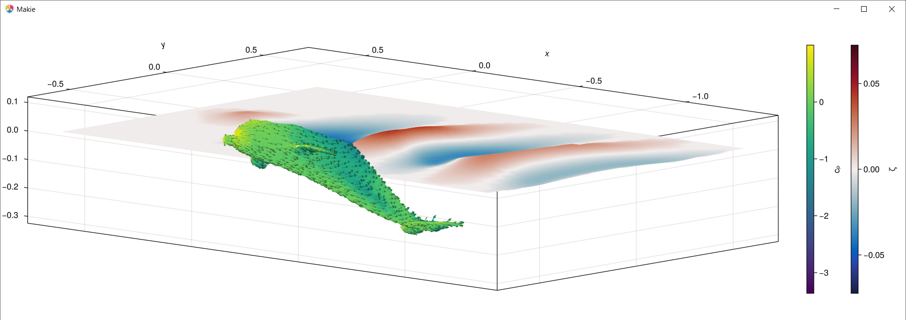
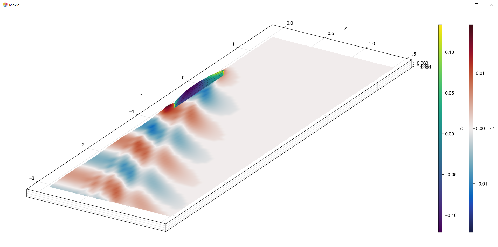

# NeumannKelvin.jl

[](https://github.com/weymouth/NeumannKelvin.jl/actions/workflows/CI.yml?query=branch%3Amain)


Calculation of the linear free-surface potential using Neumann boundary conditions on source panels and Kelvin Green's functions.

## Capabilities

This package defines three `PanelSystem` structs:
1. `BodyPanelSystem` for bodies in unbounded potential flow, defined using a set of source panels covering the solid body. The Neumann (flow tangency) condition is applied to each panel. 
2. `FSPanelSystem` for free-surface potential flows, defined using a set of source panels covering both the body and free-surface interface. The linear FSBC (free-surface boundary condition) is applied to the free-surface panels.
3. `NKPanelSystem` for free-surface potential flows, defined using a set of Kelvin panels on the body which automatically satisfies the linear FSBC on `z=0`. The Neumann condition is applied on each panel.

The package also defines:
 - `PanelTree` struct to accelerate the evaluation of the potential over a set of panels using a Barnes-Hut style monopole approximation for panels far from the query point.
 - `directsolve!`,`gmressolve!` functions to solve for the system source strength.
 - Functions to measure the induced potential `Φ` and its various "downstream" properties `∇Φ,u,cₚ,steadyforce,addedmass,ζ`, where all derivatives are computed using `ForwardDiff.jl`.

## Installation & version info

The package is registered, so after installing Julia (version >1.5), you only need to open the REPL and type
```julia
] add NeumannKelvin
```
The first install will take a few seconds as a few functions precompile, but the following times should be immediate.

The solver is still in development (v0.8), but the interface and methods are stablizing. We should be ready for v1.0 after feedback from users.

## Basic usage

The panels themselves can either be defined by reading in a triangle-based Mesh object or by measuring a parametric surface. For example a spheroid under the free-surface may be defined as:
```julia
using NeumannKelvin
h = 0.1 # spacing
freesurf = measure.((u,v)->SA[u,-v,0],2:-h:-4,(-2:h:2)',h,h)
S(θ₁,θ₂) = SA[0.5cos(θ₁),-0.1sin(θ₂)*sin(θ₁),0.1cos(θ₂)*sin(θ₁)-0.15]
body = panelize(S,0,π,0,2π,hᵤ=h)
```
The `measure` function measures a parametric surface into a single panel given a center and extent in `u,v`. Here, we broadcast `measure` over a simple planar surface to define the free-surface mesh `freesurf`. The `panelize` function generalizes this procedure, adaptively sampling a parametric surface over a given `u,v` range to achieve a desired spacing and deviation tolerance between the panels and original surface. The `panelize` function returns a `Table` from TypedTables.jl since the method won't generally form a structured grid. See the documentation for `measure`, `panelize` for details.

Next the panel system can be defined and solved. For an unbounded potential flow solution with a small number of panels like this one, we can use
```julia
julia> sys = BodyPanelSystem(body) |> directsolve!
Warning: This routine ignores free surface panels and is memory intensive. See help?>directsolve!.
└ @ NeumannKelvin c:\Users\gweymouth\Documents\GitHub\NeumannKelvin.jl\src\solvers.jl:72
  0.000332 seconds (132 allocations: 168.391 KiB)
BodyPanelSystem
  body: Table with 9 columns and 96 rows
     area & volume: 0.5019560344511921, 0.02079102608493166
     panel type: NeumannKelvin.QuadKernel
  background flow U: [-1, 0, 0]
  mirrors: ([1, 1, 1],)
  strength extrema: (-0.07478205822184282, 0.07478205822184263)
```
You can see that some basic properties of the panelized body, panel type, flow parameters, and solution are shown. You can also see the solution method is very fast, 330μs on my laptop for this small 96 panel system.

For larger systems, it's very helpful to accelerate the solution by wrapping the panels in a `PanelTree` and using the matrix-free iterative solver:
```julia
julia> bigbody = panelize(S,0,π,0,2π,hᵤ=1/200,N_max=Inf); #20k panels

julia> sys = BodyPanelSystem(bigbody,wrap=PanelTree) |> gmressolve!
SimpleStats
 niter: 4
 solved: true
 inconsistent: false
 indefinite: false
 npcCount: 0
 residuals: []
 Aresiduals: []
 κ₂(A): []
 timer: 792.14ms
 status: solution good enough given atol and rtol

BodyPanelSystem
  body: PanelTree(20096 panels, 16 levels, θ²: 9)
     area & volume: 0.5019251097019334, 0.020944737007987515
     panel type: NeumannKelvin.QuadKernel
  background flow U: [-1, 0, 0]
  mirrors: ([1, 1, 1],)
  strength extrema: (-0.0870901881812638, 0.08709074525159503)
```
This 20k panel system still takes less than a second to solve using this approach. See the documentation for `PanelTree` and `gmressolve!` for details. 

Since this body is symmetric in y, we could further increase the speed by using a half of the body and applying the method of images on the symmetry axis.
```julia
julia> halfbody = panelize(S,0,π,0,π,hᵤ=1/200,N_max=Inf); # half the θ₂ range

julia> BodyPanelSystem(halfbody,wrap=PanelTree,sym_axes=2) |> gmressolve!
SimpleStats
 niter: 4
 solved: true
 inconsistent: false
 indefinite: false
 npcCount: 0
 residuals: []
 Aresiduals: []
 κ₂(A): []
 timer: 479.57ms
 status: solution good enough given atol and rtol

BodyPanelSystem
  body: PanelTree(10048 panels, 15 levels, θ²: 9)
     area & volume: 0.25096255485096675, 0.01047237643741015
     panel type: NeumannKelvin.QuadKernel
  background flow U: [-1, 0, 0]
  mirrors: ([1, -1, 1], [1, 1, 1])
  strength extrema: (-0.08747539911219676, 0.08749685245478724)
```
Where we see half the number of panels and approximately half the solve time, but also the new `mirror=[1,-1,1]` enforcing symmetry and therefore nearly identical solution extrema.

With the system solved, we can now measure any properties of interest. For example, the extreme values of the pressure coefficient and the added mass.
```julia
julia> extrema(cₚ(sys))
(-0.12323837497458068, 0.977864810013905)

julia> addedmass(sys)
3-element SVector{3, Float64} with indices SOneTo(3):
 0.05907144178034771
 7.054090093897268e-5
 3.247604894181291e-5
```
The max cₚ=1 because of the stagnation point, but the added mass is small because the flow direction was aligned with the long axis of the spheroid. We can compute the other added mass coefficient by rotating the body or (easier) the background flow U:

>**Note:** You may use any length-units you want to define the body, but you must then use the same length-scale within `U`. Body volumes and areas will also be given in those units (squared & cubed). Measurements such as `cₚ`, `addedmass`, `steadyforce` and the free-surface elevation `ζ` all return dimensionless values (scaled by `|U|`, body area, volume, etc). See the documentation for each function.

```julia
julia> directsolve!(BodyPanelSystem(body,U=SA[0,-1,0]),verbose=false) |> addedmass
3-element SVector{3, Float64} with indices SOneTo(3):
 1.3036900728907295e-18
 0.8487489964044264
 7.117332991687825e-17
```
The added mass force is larger when the flow is broadside to the body, as expected.

## Free surface panel systems

For our first free-surface simulation, we can define a `FSPanelSystem` with panels on both `body` and `freesurf`. We also **must** define the Froude length ℓ≡U²/g to apply the FSBC.
```julia
# Make the free-surface grid and body panels using y-symmetry and resolving ℓ
ℓ = 1/4; h = 0.3ℓ # Froude-length and spacing
freesurf = measure.((u,v)->SA[u,-v,0],2:-h:-4,(h/2:h:2)',h,h)
halfbody = panelize(S,0,π,0,π,hᵤ=h)
```
```julia
julia> FSsys = FSPanelSystem(halfbody,freesurf;ℓ,sym_axes=2,θ²=16) |> gmressolve!
SimpleStats
 niter: 100
 solved: true
 inconsistent: false
 indefinite: false
 npcCount: 0
 residuals: []
 Aresiduals: []
 κ₂(A): []
 timer: 1.53s
 status: solution good enough given atol and rtol

FSPanelSystem
  freesurf: PanelTree(2187 panels, 13 levels, θ²: 16)
     size: (81, 27)
     panel type: NeumannKelvin.QuadKernel
  Froude length ℓ: 0.25
  body: PanelTree(72 panels, 8 levels, θ²: 16)
     area & volume: 0.25097206316403453, 0.010422384595950107
     panel type: NeumannKelvin.QuadKernel
  background flow U: [-1, 0, 0]
  mirrors: ([1, -1, 1], [1, 1, 1])
  strength extrema: (-0.09670047456210028, 0.07706274641204487)
```
Both the body and freesurf panels are wrapped in a `PanelTree` by default for `FSPanelSystems` (because the free-surface meshes are unavoidably large) but you can disable this using `wrap=identity` or adjust the Barnes-Hut cutoff using the `θ²` keyword argument.

Currently, you **must** use the matrix-free `gmressolve!` for a `FSPanelSystem` because the FSBC influence matrix hasn't been implemented. The preconditioner is also fairly basic, and this might be worth optimizing in the future to reduce the number of GMRES iterations.

Despite the large number of panels and increased iterations, the solve is still fast and we can now measure the steady wave force
```julia
julia> steadyforce(FSsys)
3-element SVector{3, Float64} with indices SOneTo(3):
  0.020252107305114217
  0.09698749907738831
 -0.00966715094756456
```
Note that we've used y-symmetry, and integrating over the half-body artificially produced a non-zero side force. However, the dynamic drag and vertical forces coefficients have been appropriately scaled by the (half) body surface area.

We can also solve flows around surface piercing bodies. As a fun illustration of a Mesh-defined body, we can use a dolphin geometry!
```julia
# Load the mesh, xform it, and filter out panels intersecting z=0
using GeometryBasics,FileIO
function affine(mesh, A, b)  # rotate, scale, and shift the mesh
    position = [Point3f(A * p + b) for p in mesh.position]
    GeometryBasics.Mesh(position, mesh.faces)
end
dolphin = let 
    mesh = load("examples//LowPolyDolphin.stl")
    mesh = affine(mesh, SA[0 -1 0;1 0 0;0 0 1]/65,SA[0.043,0,-0.09])
    filter(p->abs(p.x[3])>0.01, panelize(mesh))
end

# The rest of the system matches the example above
h = 0.04; freesurf = measure.((u,v)->SA[u,-v,0],2/3:-h:-4/3,(-2/3:h:2/3)',h,h,T=Float32); # Float32 to match the Mesh
sys = FSPanelSystem(dolphin,freesurf;ℓ=9f-2) |> gmressolve!
```
```julia
FSPanelSystem
  freesurf: PanelTree(1734 panels, 12 levels, θ²: 9)
     size: (51, 34)
     panel type: NeumannKelvin.QuadKernel
  Froude length ℓ: 0.09
  body: PanelTree(1373 panels, 12 levels, θ²: 9)
     area & volume: 0.4362399, 0.013043594
     panel type: NeumannKelvinGeometryBasicsExt.TriKernel
  background flow U: [-1, 0, 0]
  mirrors: ([1, 1, 1],)
  strength extrema: (-0.24399182f0, 0.19675535f0)
```
Note that the body panel type is now `TriKernel` because it is defined by the STL Mesh instead of a parametric surface.

Let's take a look at the geometry and flow using Makie!
```julia
using GLMakie # can also use Plots, or WGLMakie (for browsers)
viz(sys)
```


The `viz` function defines a few default visualizations for body and free-surface panel systems.

## Neumann-Kelvin system

We can satisfy the linear FSBC by construction if we switch from source panels to Kelvin panels. This has the huge advantage of perfectly resolving the linear wavefield with no free-surface panels and (after lots of optimized integral methods) much faster solve times!

Here's the same submerged spheroid example solved using Kelvin panels.
```julia
ℓ = 1/4; h = 0.3ℓ # Froude-length and spacing
halfbody = panelize(S,0,π,0,π,hᵤ=h)
```
```julia
julia> NKsys = NKPanelSystem(halfbody;ℓ,sym_axes=2) |> directsolve!
┌ Warning: This routine ignores free surface panels and is memory intensive. See help?>directsolve!.
└ @ NeumannKelvin c:\Users\gweymouth\Documents\GitHub\NeumannKelvin.jl\src\solvers.jl:72
  0.003006 seconds (132 allocations: 107.078 KiB)
NKPanelSystem
  Neumann-Kelvin args: (ℓ = 0.25, filter = true, contour = false)
  body: Table with 9 columns and 72 rows
     area & volume: 0.25097206316403453, 0.010422384595950107
     panel type: NeumannKelvin.QuadKernel
  background flow U: [-1, 0, 0]
  mirrors: ([1, -1, 1], [1, 1, 1])
  strength extrema: (-0.09838582154859293, 0.07720677207281905)

julia> steadyforce(NKsys)
3-element SVector{3, Float64} with indices SOneTo(3):
  0.02188382689421088
  0.0961015016623305
 -0.009347630235111046
```
It is encouraging that the `FSPanelSystem` solution and forces match to within a few percent of the `NKPanelSystem` solution despite that method's finite free-surface quadrature, numerical wave damping and (potentially) reflections.

The `NKPanelSystem` solve is much faster than `FSPanelSystem` - in fact it is only around 10x slower than a double body flow computed using `BodyPanelSystem` which can't predict drag and gets the wrong vertical force as well!
```julia
julia> BodyPanelSystem(halfbody;sym_axes=(2,3)) |> directsolve! |> steadyforce!
┌ Warning: This routine ignores free surface panels and is memory intensive. See help?>directsolve!.
└ @ NeumannKelvin c:\Users\gweymouth\Documents\GitHub\NeumannKelvin.jl\src\solvers.jl:72
  0.000361 seconds (132 allocations: 104.891 KiB)
3-element SVector{3, Float64} with indices SOneTo(3):
 -2.2957434790946685e-12
  0.0741385277429429
 -0.006076003552147477
```

Despite many advantages, the `NKPanelSystem` does have its own limitations:

- The inhomogeneous Kelvin Green's function means you can't use `PanelTrees` to accelerate Kelvin panels. 
- The perfect wave resolution can produce waves too small for the body panels near the free-surface to resolve, leading to convergence issues unless these are `filter`ed.
- Kelvin panels can not be extended to inforce the Nonlinear FSBC, unlike `FSPanelSystem`s which could potentially do so in the future.

See the docs for `NKPanelSystem`, `kelvin`, and the cited references for details.

As a final application, let's simulate the classic Wigley hull with `NKPanels`
```julia
wigley(hᵤ;B=1/8,D=1/16,hᵥ=0.5hᵤ/D) = measure.(
    (u,v)->SA[u-0.5,-2B*u*(1-u)*(v)*(2-v),D*(v-1)],
    0.5hᵤ:hᵤ:1,(0.5hᵥ:hᵥ:1)',hᵤ,hᵥ)
NKsys = NKPanelSystem(wigley(0.025);ℓ=1/2π,sym_axes=2,contour=true) |> directsolve!
viz(NKsys)
```

This is a fisheye view so you can see the pressure distribution and the high-resolution wave pattern. The `contour=true` flag turns on the waterline contour contribution to the potential, although this is a small contribution for the fine-bow of the Wigley hull.
